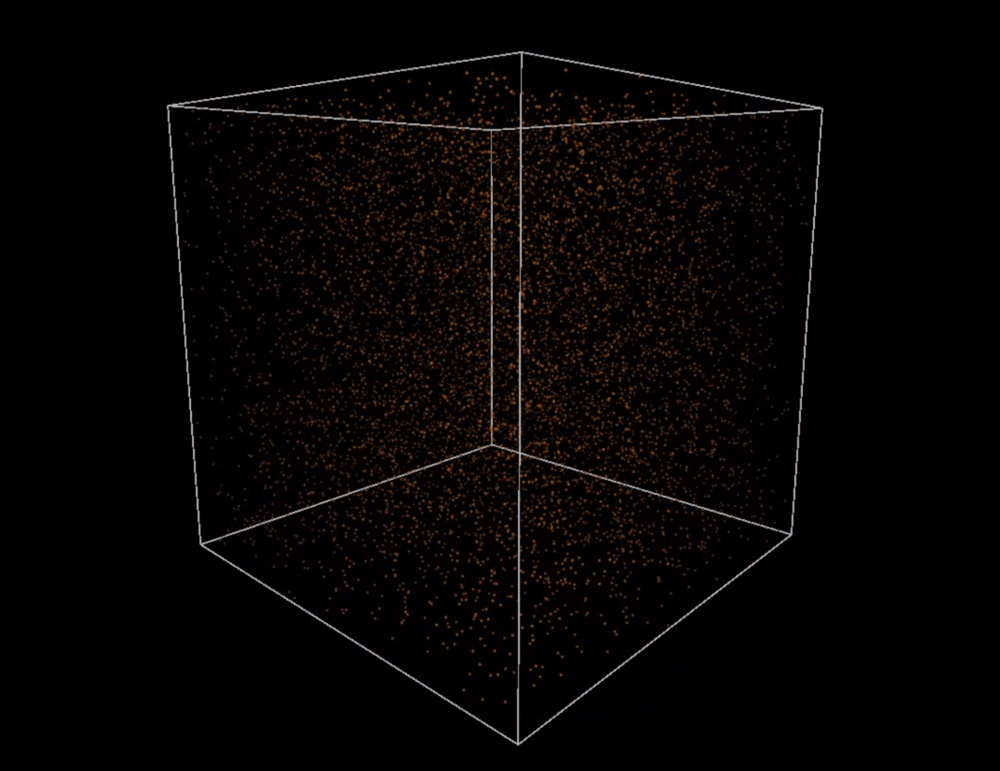
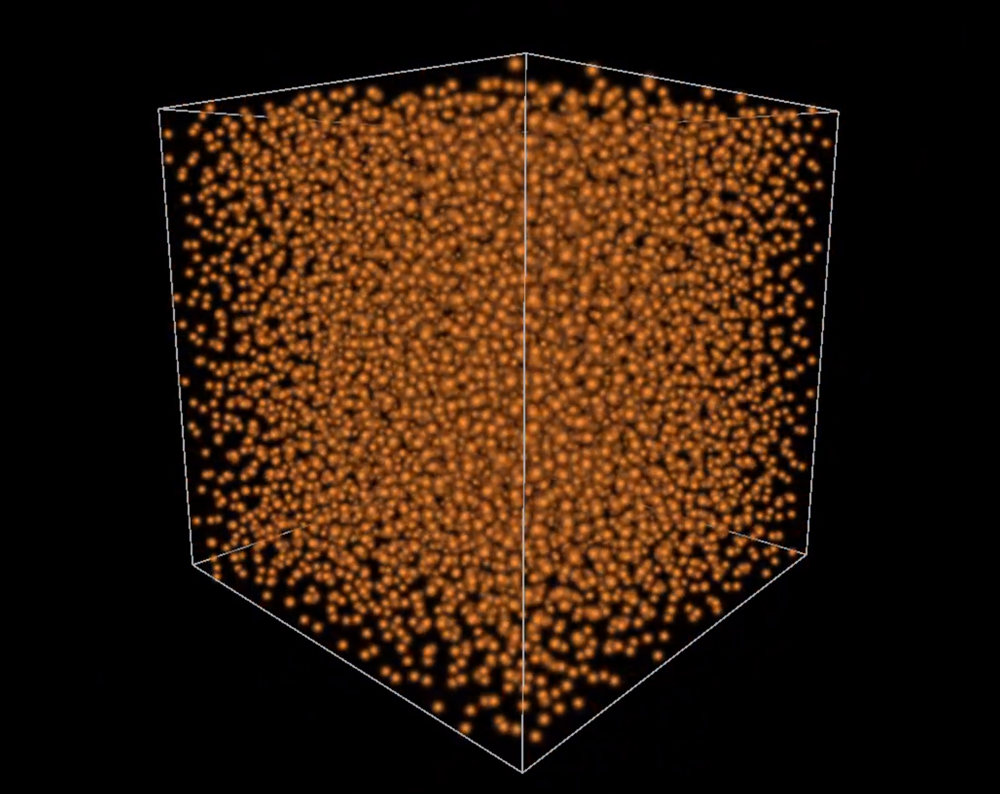
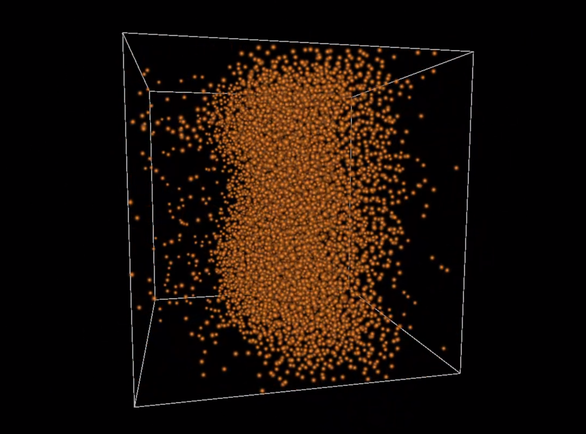
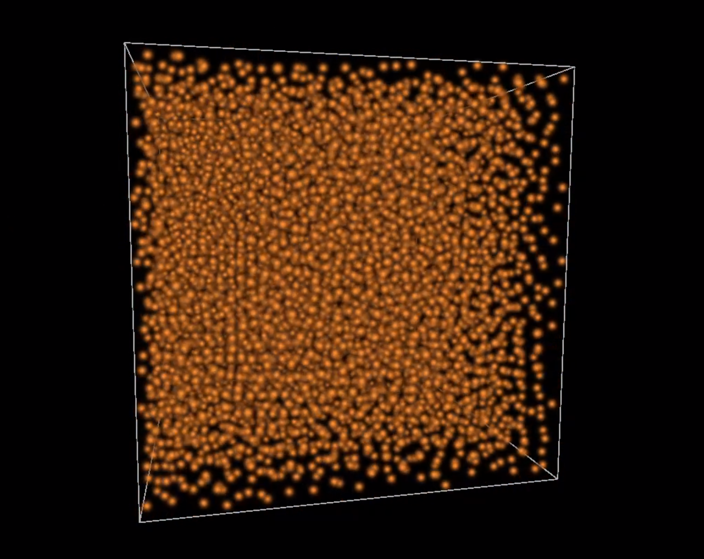

# Lennard-Jones Molecular Dynamics

An implementation of molecular dynamics simulation of the [**Lennard-Jones system**](https://en.wikipedia.org/wiki/Lennard-Jones_potential) in a box with real-time visualization. 
The code solves the N-body problem numerically and utilizes CUDA-enabled NVIDIA GPU's to significantly accelerate the calculations, allowing real-time simulation (~60 frames per second) of large systems containing thousands of particles.
The code uses reduced variables and allows to study the thermodynamic properties of the Lennard-Jones system.

This implementation was inspired by the [nbody](https://developer.nvidia.com/gpugems/gpugems3/part-v-physics-simulation/chapter-31-fast-n-body-simulation-cuda) example from NVIDIA CUDA SDK.

The code is separated into three parts:
- the core library
- a graphical user interface (GUI) program to run the box simulation and visualization
- an [example](src/tasks/semiGCEfluctuations/semiGCEfluctuations.cpp) of running the simulation from command line


## Features

- Adjust the number of particles, temperature and density, and the time step
- Switch between CPU or GPU (CUDA) based calculation
- Velocity Verlet integrator
- Microcanonical (*EVN*) or canonical-like (*TVN*, constant kinetic temperature dynamics) ensemble
- Periodic or hard-wall boundary conditions
- Real-time visualization of the system motion (in OpenGL)
- Calculation and visualization of the [radial distribution function](https://en.wikipedia.org/wiki/Radial_distribution_function) and the velocity distribution

<p align="center">
  
</p>

## Prerequisites

- [CMake](https://cmake.org/) v3.18+

For using CUDA-enabled GPUs
- [NVIDIA CUDA Toolkit](https://developer.nvidia.com/cuda-toolkit), tested on v10.2+
- CUDA-enabled GPU (otherwise only the CPU simulation can be used) with compute capability 3.0+

For the graphical user interface
- [Qt5](https://doc.qt.io/qt-5/) framework and **OpenGL** support to run the GUI
  
The code is cross-platform and based on CMake. It has been tested on Microsoft Windows 10 (using Visual Studio or CLion IDE), Ubuntu 20.04 (via the command line), Mac OS 13.2 Ventura (both CLion IDE or command line)

## Usage

Use the CMake to generate the project and build it.
Make sure that CMake can find the CUDA toolkit and Qt5.
An example on Unix:

```bash
mkdir build
cd build
cmake ../
make

# Run the GUI program
./src/gui/QtLennardJones
```


## Examples

|   |   |
|:-------------------------:|:-------------------------:|
| gaseous phase (T* = 1, ρ* = 0.01) | liquid phase (T* = 1, ρ* = 0.85)|
|   |   |
| mixed phase (T* = 1, ρ* = 0.3) | solid phase (T* = 1, ρ* = 1.1)|

## Third-party code

- The [`helper-cuda.h`](https://raw.githubusercontent.com/NVIDIA/cuda-samples/master/Common/helper_cuda.h) and [`helper_string.h`](https://raw.githubusercontent.com/NVIDIA/cuda-samples/master/Common/helper_string.h) CUDA headers that are either downloaded from GitHub at the CMake step or taken from CUDA SDK if it is installed in the system
- [**Mersenne Twister**](http://www.math.sci.hiroshima-u.ac.jp/~m-mat/MT/emt.html) random number generator by M. Matsutomo and T. Nishimura ([implementation](http://www.math.sci.hiroshima-u.ac.jp/~m-mat/MT/VERSIONS/C-LANG/MersenneTwister.h) by R. J. Wagner)
- [**Qt5 framework**](https://www.qt.io) for the GUI frontend ([LGPL3](http://doc.qt.io/qt-5/lgpl.html))
- [**QCustomPlot**](https://www.qcustomplot.com/) Qt C++ widget for plotting and data visualization by Emanuel Eichhammer ([GPL](https://www.gnu.org/licenses/gpl.html))


*Copyright (C) 2013-2023  Volodymyr Vovchenko*
